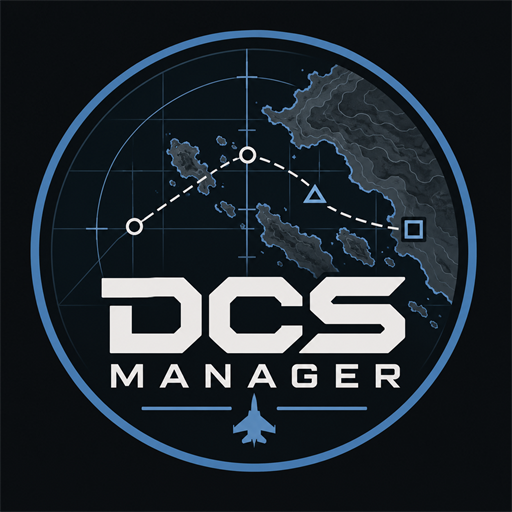

<div align="center">
  
</div>

# DCS Manager

🇬🇧 English | [🇫🇷 Français](README.fr.md)

An all-in-one companion for **DCS World**: debriefing reading, advanced statistics, sortie analysis, airfield reference and aeronautical charts. It runs **locally, on the same Windows machine as DCS**: one `dcsmanager.exe`, no server, no container, nothing to configure. It opens in **its own window**, like an ordinary application: no browser to launch, no address to remember.

Because it is local, it can read **DCS's own files** — the airfields, frequencies and beacons of every installed map, as well as the Saved Games folder — instead of relying on a hand-maintained dataset.

---

## Table of contents

- [Features](#features)
- [Architecture](#architecture)
- [Prerequisites](#prerequisites)
- [Installation guide](#installation-guide)
- [Quick start (PoC Phase 0)](#quick-start-poc-phase-0)
- [Configuration](#configuration)
- [Installing the Lua scripts into DCS](#installing-the-lua-scripts-into-dcs)
- [Deployment](#deployment)
- [Project structure](#project-structure)
- [Roadmap](#roadmap)
- [License](#license)

---

## Features

| Feature | Status | Details |
|---|---|---|
| Debriefings | ✅ Phase 3 | Network transfer of `debrief.log`, Lua parser, history |
| Advanced stats | ✅ Phase 4 | Pilots, weapons, engines, balance, network (career + mission), merged with the logbook in one **Career & statistics** tab |
| Aerodromes | ✅ Phase 6 | Read from DCS's own terrain files: **220 airfields listed, 146 mappable** across 6 installed maps, with Tower/TACAN/ILS/VOR/RSBN/NDB, and their charts. A bundled dataset covers Caucasus and Cold War Germany when DCS cannot be read |
| Aeronautical charts | ✅ Phase 6 | Approach plates and ground plans indexed from `maps_dcs/` and shown as documents |
| Installed modules | ✅ New | Terrains, aircraft, campaigns and tech packs, read from DCS's own inventory; **owned** (bought) and **installed** (on disk) shown apart |
| Career | ✅ New | The player's logbook: rank, squadron, awards, hours and kills per airframe — shown atop the statistics |
| Settings | ✅ New | One tab grouping the installed modules, the DCS-side install (mods, script state, shared `Export.lua`), the cockpit panels (PZ55/PZ70, DCS-BIOS, mappings) and the **player-profile backup** as sub-tabs |
| Profile backup | ✅ New | Save/restore the logbook, bindings, options and scripts (and optionally kneeboard, missions, mods) as a portable zip, from the CLI, the API or Settings |
| Local by design | ✅ New | One self-contained Windows `.exe`, no server and no container: SQLite persistence in `data/`, and every read (terrains, Saved Games) happens on the same machine as DCS |

> The live map (and its imagery) has been **removed**. Unit telemetry is still
> received and sampled: it feeds the statistics and the airfields tab (nearest
> field), and it is kept in the database so a future analysis view would have a
> history to draw on. The manager is now debrief-, stats- and airfields-oriented.

### Cockpit panels and Lua installation

PZ55/PZ70 panels are read directly through HID, **without vJoy or an additional
Windows driver**. The visual editor supports contextual wheel bindings, custom
positions, LED rules, LCD sources and portable profile import/export. Seven
profiles are provided: F/A-18C, F-16C, F-5E-3, M-2000C, A-10C, JF-17 and AV-8B.
The Hornet has 20 input bindings and three landing-gear LED sources.

Bindings remain in DCS Manager; this does not add controller columns to DCS.
DCS-BIOS remains required for existing cockpit commands and LED feedback. The
F/A-18C pitch trim uses our Lua plugin on local UDP port 7780, with a bounded queue,
acknowledgements and automatic release. Some controls remain unassigned; LCD is optional.
**Physical trim movement, LED behaviour and multiplayer support remain to be
validated in DCS.** An acknowledgement only confirms an error-free Lua device call.

Close DCS, then open **Settings → DCS install → Install / update scripts**.
The installer detects Saved Games, installs four bundled files, preserves other
exports and existing user settings, and displays backups. It refuses to run while
DCS.exe is active. Start DCS again after installation. During development,
the prepared executable is `dcsmanager-panels.exe`.

See the [profile library](profiles/panels/README.fr.md) and
[plugin installation, tests and rollback](docs/plugin-panels-dcs.fr.md) (French).

### Advanced statistics (planned)

- **Pilot & career profile** — kills/deaths/KD, ejections, crashes, flight time, by **UCID**
- **Weapon analysis** — effectiveness per weapon, kill matrix, friendly-fire
- **Balance & meta** — coalition balance, aircraft flown, mission timeline
- **Network quality** — ping, disconnections, error codes
- **Analysis by engine** — exact **DCS type** granularity (`F-16C_50`, `T-72B`, `SA-10`…), platform + target + matchups

---

## Architecture

```
                      WINDOWS (one machine)
┌──────────────────────────────────────────────────────────┐
│ DCS World                                                 │
│  Scripts/Export.lua      → positions (UDP/JSON)           │
│  Scripts/Hooks/dcsmanager.lua → events/players/chat (TCP/JSON) │
└──────────────┬───────────────────────────────────────────┘
               │ 127.0.0.1 — nothing to configure
               ▼
┌──────────────────────────────────────────────────────────┐
│ dcsmanager.exe — Go backend + embedded Web UI                  │
│  • UDP + TCP listeners, in-memory state, SQLite (data/)   │
│  • debrief parser, statistics, airfield reference         │
│  • reads Mods/terrains/ and Saved Games/ directly         │
│  • REST + SSE, served to the native window (WebView2)     │
│    — or to a browser in `serve` mode                      │
└──────────────────────────────────────────────────────────┘
```

### Native window

The web UI is unchanged: it is simply shown in an **application window** (WebView2
component, bundled with Windows 10/11) instead of a browser tab. The HTTP server keeps
running behind the window — it is what serves the API — so nothing that existed is
lost: `dcsmanager serve` starts the manager in "browser" mode, for instance to reach it
from a second monitor or a tablet.

The manager refuses to start twice: if an instance already answers on
`DCSMANAGER_HTTP_ADDR`, window mode shows a message and stops, and `dcsmanager serve` exits
with code 3. In window mode, a log is written to `data/dcsmanager.log` (next to the
database), since a double-clicked executable has no console.

### Local by design

```
   dcsmanager.exe runs ON THE SAME WINDOWS MACHINE AS DCS
   → no LAN address to set, no firewall rule, no container
   → direct read access to Mods/terrains/ and Saved Games/
```

**Stack:** Go (backend, single binary + embedded UI) · Svelte + Vite (frontend) · SQLite (persistence).

---

## Prerequisites

### DCS side (machine A, Windows)

- DCS World (latest stable version or open beta)
- Access to `%USERPROFILE%\Saved Games\DCS\` (or `DCS.openbeta`)
- LuaSocket — bundled with DCS, no installation required

### Development / manager side

- **Go 1.25+** — <https://go.dev/dl/> (`winget install GoLang.Go`)
- **Node.js 20+** — <https://nodejs.org/> (only to build the frontend)
- **Git**

---

## Installation guide

For a complete, step-by-step installation — release download, Lua script
installation, first launch, configuration, troubleshooting — see
**[`docs/installation.md`](docs/installation.md)**.

---

## Quick start (PoC Phase 0)

The PoC validates the whole chain: **DCS → UDP → Go → SSE → browser**.

### 1. Start the manager

```powershell
# Backend only (also serves a placeholder if the frontend is not built)
go run ./backend/cmd/dcsmanager
```

By default, the backend listens on:

- `127.0.0.1:7776` over **UDP** (positions)
- `127.0.0.1:8080` over **HTTP** in `serve` mode (Web UI + SSE); window mode can pick a free port

The manager then opens in a **native window**. In `serve` mode it opens no window and
the interface is reached at <http://localhost:8080>.

### 2. Install the Lua scripts into DCS

Close DCS, then open **Settings → DCS install → Install / update scripts**.
See [Installing the Lua scripts into DCS](#installing-the-lua-scripts-into-dcs)
for the installed files and the CLI alternative.

### 3. Launch DCS and a mission

The manager picks the session up: events and players are recorded, and each
mission is saved for the debriefs and the statistics.

---

## Configuration

All configuration is done through **environment variables** (prefix `DCSMANAGER_`) with sensible
defaults. None of them is required for a normal install.

| Variable | Default | Description |
|---|---|---|
| `DCSMANAGER_HTTP_ADDR` | `127.0.0.1:8080` | HTTP listening address (Web UI + SSE). A port of `0` picks a free one automatically (native window). Set `0.0.0.0:8080` to reach the UI from another device; the API has no authentication unless `DCSMANAGER_API_TOKEN` is set |
| `DCSMANAGER_API_TOKEN` | *(empty)* | When set, non-loopback callers must present it (Authorization: Bearer, or `?token=`) to reach the manager. Required when exposing it beyond the local machine (e.g. a plugin on another host). Local (loopback) access is always allowed |
| `DCSMANAGER_UDP_ADDR` | `127.0.0.1:7776` | UDP listening address (unit telemetry). Not 7778: **DCS-BIOS owns that port**, and the two are meant to run together |
| `DCSMANAGER_TCP_ADDR` | `127.0.0.1:7779` | TCP listening address (events + commands) |
| `DCSMANAGER_DB_PATH` | `./data/dcsmanager.db` | SQLite database path |
| `DCSMANAGER_DB_ENABLED` | `true` | Enable persistence (otherwise everything in memory) |
| `DCSMANAGER_THEATRE` | `Caucasus` | Default theatre |
| `DCSMANAGER_UNIT_TTL` | `5` (seconds) | Delay before a silent unit disappears |
| `DCSMANAGER_CATEGORIES` | `./categories.json` | Override for engine classification |
| `DCSMANAGER_MAX_UNITS` | `5000` | Maximum number of tracked units |
| `DCSMANAGER_TRACK_INTERVAL` | `3` (seconds) | Position sampling frequency |
| `DCSMANAGER_TRACK_GRACE` | `15` (seconds) | Absence before a unit counts as lost |
| `DCSMANAGER_TRACK_RETENTION` | `86400` (seconds) | History retention duration |
| `DCSMANAGER_SAVED_GAMES` | *(auto)* | DCS Saved Games folder, when auto-detection fails |
| `DCSMANAGER_CHARTS_DIR` | `./maps_dcs` | Aeronautical chart scans (approach plates, ground plans) |
| `DCSMANAGER_SOURCE` | *(auto)* | Force the session source: `live` or `test` (see below) |
| `DCSMANAGER_LOG_LEVEL` | `info` | `debug`, `info`, `warn`, `error` |
| `DCSMANAGER_DEBUG` | `false` | Live debug logging (actions, API requests, panels). Also toggled from Settings → Debug |

### DCS side — `Saved Games\DCS\Config\dcsmanager.cfg`

```lua
-- Backend address (the manager runs locally)
dcsmanager_host = "127.0.0.1"
dcsmanager_udp_port = 7776
dcsmanager_tcp_port = 7779

-- Telemetry
dcsmanager_send_interval = 1.0    -- player position (seconds)
dcsmanager_world_enabled = true   -- export all objects
dcsmanager_world_interval = 2.0   -- object list (seconds)
dcsmanager_world_radius = 0       -- radius filter in km (0 = all)
```

---

## Installing the Lua scripts into DCS

> ⚠️ **Always merge, never overwrite.** `Export.lua` is very often already modified by
> Tacview, SRS, DCS-BIOS, etc. Back up the existing file before any modification.

The scripts go into DCS's *Saved Games* folder:

```
%USERPROFILE%\Saved Games\DCS\          (or DCS.openbeta)
├─ Config\
│   └─ dcsmanager.cfg          ← backend address configuration
└─ Scripts\
    ├─ Export.lua             ← telemetry and panel plugin; merged with existing exports
    ├─ DCSManager\
    │   └─ PanelCommands.lua  ← F/A-18C trim receiver (UDP 127.0.0.1:7780)
    └─ Hooks\
        └─ dcsmanager.lua      ← events, players, chat (Phases 2+)
```

1. Close DCS and start the updated application.
2. Open **Settings → DCS install**, check the detected folder, then click
   **Install / update scripts**. Existing exports and configuration are preserved;
   changed files are backed up. The script status refreshes immediately.
3. Start DCS and load a mission. DCS-BIOS must be installed separately for the panels.

PowerShell alternative from the executable's folder:

```powershell
.\dcsmanager.exe install-lua --saved-games "$env:USERPROFILE\Saved Games\DCS" --dry-run
.\dcsmanager.exe install-lua --saved-games "$env:USERPROFILE\Saved Games\DCS"
```

The CLI can update an existing configuration, with backup; the one-click installer
preserves it. Use `dcsmanager-panels.exe` instead if running the development build.
If detection fails, set `DCSMANAGER_SAVED_GAMES` before starting the application.

---

## Deployment

### Windows `.exe`

```powershell
# 1. Build the frontend and the backend
.\build.ps1

# 2. Install the scripts on the DCS side (safe merge into Saved Games)
.\install-dcs.ps1            # add -DryRun to simulate

# 3. Run
.\dcsmanager.exe
```

The manager opens in its own window. To reach the interface from a browser instead
(second monitor, tablet), run `.\dcsmanager.exe serve` and open <http://localhost:8080>.

### CLI

```powershell
dcsmanager                 # opens the manager in a native window
dcsmanager serve           # starts the server only; UI at http://localhost:8080
dcsmanager install-lua     # installs/merges the Lua scripts into Saved Games
dcsmanager uninstall-lua   # removes the installed block (keeps the config)
dcsmanager status          # installed / outdated / missing, per file
dcsmanager purge           # deletes recorded sessions (destructive)
dcsmanager backup          # saves a DCS player profile to a portable archive
dcsmanager restore         # restores a profile archive into Saved Games
dcsmanager version
```

### Test sessions and `purge`

The test tools (`tools/send-telemetry.mjs`, …) speak exactly the same protocol as
DCS, so a session recorded while they are running is indistinguishable from a real
flight. Every session is therefore tagged with a **source**:

- `live` — recorded from DCS. Statistics count these.
- `test` — recorded from the test tools. Kept on disk, but **excluded from
  statistics, analytics and the dashboard** unless explicitly requested.

Detection is automatic: the backend recognises the fixture callsigns used by
`tools/send-telemetry.mjs`. Set `DCSMANAGER_SOURCE=test` (or `live`) to force the
verdict when you use your own fixtures.

```powershell
dcsmanager purge --source test          # delete simulated sessions only
dcsmanager purge --mission-id 3         # delete one mission and everything linked to it
dcsmanager purge --all                  # delete every recorded session
dcsmanager purge --source test --dry-run  # show what would be deleted, delete nothing
```

Statistics accept `?includeTest=1` to include simulated sessions deliberately.

---

## Project structure

```
DCS Manager/
├─ README.md                 # English (primary)
├─ README.fr.md              # French
├─ CHANGELOG.md / .fr.md
├─ VERSION
├─ Makefile / build.ps1       # build commands (winres target regenerates the icon)
├─ install-dcs.ps1           # installs the Lua scripts into Saved Games
├─ dcs-lua/                  # scripts to install on the DCS side
│   ├─ Config/dcsmanager.cfg      # configuration template
│   ├─ Export.lua            # positions → UDP (live map)
│   └─ Hooks/dcsmanager.lua       # events / players / chat
├─ backend/                  # Go
│   ├─ go.mod
│   ├─ cmd/dcsmanager/main.go     # CLI (desktop / serve / install / purge)
│   ├─ internal/
│   │   ├─ desktop/          # native window (WebView2, pure Go)
│   │   ├─ app/              # manager wiring, shared by desktop / serve
│   │   ├─ config/           # env loading + defaults
│   │   ├─ install/          # Lua injector (merge via markers)
│   │   ├─ aerodrome/        # aerodromes and frequencies (embedded data)
│   │   ├─ category/         # engine classification (DCS type → family)
│   │   ├─ theatre/          # DCS theatres
│   │   ├─ charts/           # aeronautical chart scans (maps_dcs/)
│   │   ├─ model/            # types exchanged DCS ↔ backend
│   │   ├─ lua/              # Lua data parser (debrief.log)
│   │   ├─ debrief/          # debrief analysis
│   │   ├─ debriefstore/     # reassembly of debrief transfers
│   │   ├─ udp/              # unit telemetry receiver
│   │   ├─ tcp/              # event / player / chat receiver
│   │   ├─ live/             # in-memory session state
│   │   ├─ ingest/           # live → database bridge
│   │   ├─ tracker/          # position history + loss detection
│   │   ├─ db/               # persistence: SQLite store behind the Store interface
│   │   ├─ backup/           # player-profile save/restore (zip)
│   │   ├─ state/            # unit store (in memory)
│   │   ├─ stats/            # statistical aggregations
│   │   └─ api/              # REST + SSE + embedded UI (dist/)
├─ frontend/                 # Svelte + Vite
│   └─ src/
│       ├─ App.svelte
│       └─ lib/              # panels and stores
├─ maps_dcs/                 # aeronautical chart scans (local, not versioned)
├─ tools/                    # test telemetry emitter
└─ docs/                     # documentation
```

---

## Roadmap

- [x] **Phase 0 — PoC**: `Export.lua` (player position) → Go → UI
- [x] **Phase 2 — Events & players**: `onGameEvent`, `net.get_stat`, SQLite history (the Session tab is now removed; events and players are still recorded for the stats and the debriefs)
- [x] **Phase 3 — Debriefings**: network transfer of `debrief.log`, Lua parser, history
- [x] **Phase 4 — Advanced stats**: overview, pilots, weapons, engines, balance, network
- [x] **Phase 4 bis — Analytical maps & sortie**: heatmaps, trails, telemetry
- [x] **Phase 5 — Packaging**: CLI, safe Lua injector, single self-contained binary
- [x] **Phase 6 — Aerodromes**: read from DCS's own terrain files (frequencies, aids, charts)
- [ ] **Phase 1 — Live map**: removed; telemetry is still collected for analysis

The full, detailed plan is available in the project's plan file.

---

## License

[MIT](LICENSE) © 2026 Laurent (lolo1580)

This is a community project, not affiliated with or endorsed by Eagle Dynamics.
"DCS World" and its terrains are trademarks of Eagle Dynamics SA.
