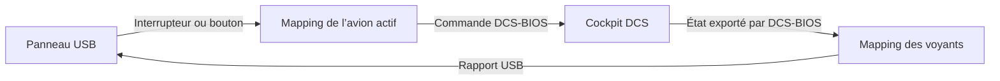

# Schéma des panneaux PZ55 et PZ70 et fonctionnement du mapping

Cette analyse décrit le code actuel du DCS Mission Manager. Elle repose sur la lecture du projet et de la documentation Logitech ; le fonctionnement sur les panneaux physiques reste à vérifier en session DCS.

## Les deux panneaux

| Panneau | Commandes physiques | Retours visuels |
|---|---|---|
| **PZ55 Switch Panel** | Batterie, alternateur, avionique, pompe, dégivrage, chauffage Pitot, volets de capot, éclairage, sélecteur moteur et levier de train | Trois voyants de train : vert, rouge ou jaune |
| **PZ70 Multi Panel** | Sélecteur ALT/VS/IAS/HDG/CRS, molette de réglage, huit boutons de pilote automatique, auto-throttle, volets et trim | Deux lignes LCD et voyants des boutons |

Sur le PZ70, le sélecteur choisit normalement la valeur que la molette règle, comme l’altitude ou le cap. Voir le [manuel Logitech](https://www.logitech.com/assets/65126/flight-multi-panel.pdf).

Les panneaux sont reconnus par leurs identifiants USB :

| Modèle | Identifiant vendeur (VID) | Identifiant produit (PID) |
|---|---|---|
| PZ55 | `0x06A3` | `0x0D67` |
| PZ70 | `0x06A3` | `0x0D06` |

## Schéma de fonctionnement

Le mapping fonctionne dans deux directions : les actions du panneau commandent le cockpit, et les états du cockpit pilotent les voyants du panneau.

Le gestionnaire lit directement les panneaux USB. DCS-BIOS assure la liaison avec le cockpit DCS. Par défaut, les commandes sont envoyées en UDP à `127.0.0.1:7778`.

## Contrôles physiques reconnus

### PZ55 Switch Panel

| Groupe | Identifiants dans le projet |
|---|---|
| Alimentation | `MASTER_BAT`, `MASTER_ALT`, `AVIONICS_MASTER` |
| Systèmes | `FUEL_PUMP`, `DE_ICE`, `PITOT_HEAT`, `COWL` |
| Éclairage | `LIGHTS_PANEL`, `LIGHTS_BEACON`, `LIGHTS_NAV`, `LIGHTS_STROBE`, `LIGHTS_TAXI`, `LIGHTS_LANDING` |
| Sélecteur moteur | `ENGINE_OFF`, `ENGINE_RIGHT`, `ENGINE_LEFT`, `ENGINE_BOTH`, `ENGINE_START` |
| Levier de train | `GEAR_UP`, `GEAR_DOWN` |

Les noms décrivent les commandes physiques. Leur fonction dans DCS dépend du profil de l’avion : un interrupteur marqué « batterie » peut être affecté à une autre commande.

### PZ70 Multi Panel

| Groupe | Identifiants dans le projet |
|---|---|
| Sélecteur | `KNOB_ALT`, `KNOB_VS`, `KNOB_IAS`, `KNOB_HDG`, `KNOB_CRS` |
| Molette de réglage | `LCD_WHEEL` ; le décodage distingue les deux sens avec `Clockwise` |
| Boutons | `AP_BUTTON`, `HDG_BUTTON`, `NAV_BUTTON`, `IAS_BUTTON`, `ALT_BUTTON`, `VS_BUTTON`, `APR_BUTTON`, `REV_BUTTON` |
| Auto-throttle | `AUTO_THROTTLE` |
| Volets | `FLAPS_UP`, `FLAPS_DOWN` |
| Molette de trim | `PITCH_TRIM` ; le décodage distingue les deux sens avec `Clockwise` |

## Profils et affectations

Chaque avion possède son profil dans `mappings.json`, à côté de la base de données. Le profil contient :

- `aircraft` : le nom du module DCS ;
- `bindings` : les commandes envoyées depuis les contrôles physiques ;
- `outputs` : les états DCS-BIOS utilisés pour piloter les voyants.

Une affectation d’entrée contient :

| Champ | Rôle |
|---|---|
| `model` | Panneau : `pz55` ou `pz70` |
| `control` | Identifiant du contrôle physique |
| `command` | Identifiant de la commande DCS-BIOS |
| `interface` | Type d’action : `set_state`, `fixed_step`, `variable_step` ou `action` |
| `invert` | Inversion facultative de l’état actif |

Une seule affectation est autorisée par couple panneau/contrôle dans un profil. Les affectations ciblent le modèle du panneau, sans distinguer deux exemplaires du même modèle.

### Exemples des profils intégrés

| Avion | Contrôle physique | Commande affectée |
|---|---|---|
| F/A-18C | PZ55 batterie | `BATTERY_SW` |
| F/A-18C | PZ55 train haut/bas | `GEAR_LEVER` |
| F/A-18C | PZ70 volets haut/bas | `FLAP_SW` |
| F-16C | PZ70 trim | `PITCH_TRIM` |
| Mirage 2000C | PZ70 bouton AP | `AP_MASTER_BTN` |

Des profils de départ existent pour le F/A-18C, le F-16C, le Mirage 2000C et le F-5E. Ils sont créés lorsque le fichier de mapping n’existe pas encore ; les affectations enregistrées dans un fichier existant sont conservées.

## Mapping des voyants

Une affectation de sortie contient le modèle, la cible physique, le contrôle exporté par DCS-BIOS et la couleur éventuelle.

| Panneau | Cibles disponibles |
|---|---|
| PZ55 | `LIGHT_GEAR_UPPER`, `LIGHT_GEAR_LEFT`, `LIGHT_GEAR_RIGHT` |
| PZ70 | `LIGHT_AP`, `LIGHT_HDG`, `LIGHT_NAV`, `LIGHT_IAS`, `LIGHT_ALT`, `LIGHT_VS`, `LIGHT_APR`, `LIGHT_REV` |

Le pilote des voyants lit le premier export du contrôle DCS-BIOS : une valeur non nulle allume le voyant, zéro l’éteint. Le PZ55 accepte une couleur verte, rouge ou jaune. Les voyants du PZ70 sont monochromes.

Dans le chemin normal, la synchronisation des voyants exige que l’envoi soit activé. L’envoi est désactivé à chaque redémarrage du gestionnaire.

## Limites constatées dans le code actuel

1. **Sens des molettes ignoré par le mapping.** Le décodage USB distingue les deux directions, mais le moteur de mapping n’utilise pas `Clockwise`. Les impulsions des deux sens ont un état actif vrai et peuvent donc produire la même commande, notamment avec `variable_step`.
2. **Sélecteur PZ70 indépendant de la molette.** Aucune logique actuelle ne change l’affectation de `LCD_WHEEL` selon ALT, VS, IAS, HDG ou CRS. Les positions du sélecteur sont exposées comme des contrôles séparés.
3. **LCD sans mapping de valeurs du cockpit.** Le code sait construire un rapport d’affichage, mais les profils ne proposent pas d’affectation des valeurs DCS aux deux lignes LCD. Le pilote de sorties actuel utilise les voyants.
4. **Positions intermédiaires limitées.** Le mapping `set_state` envoie zéro ou la valeur maximale déclarée par la commande. Il ne permet pas de choisir librement une position intermédiaire.
5. **Double envoi possible.** Si l’envoi normal et le mode test sont activés ensemble, les deux chemins transmettent la commande.
6. **Le mode test transmet réellement des commandes.** Il contourne la désactivation de l’envoi normal. Le journal de simulation et le mode test ne doivent donc pas être confondus.

Ces constats proviennent de la lecture du code. Ils ne constituent pas une validation matérielle en session DCS.

## Fichiers principaux

Les chemins ci-dessous sont relatifs à la racine du dépôt.

| Fichier | Responsabilité |
|---|---|
| `backend/internal/panel/panel.go` | Modèles USB, définition des bits des contrôles et décodage des événements |
| `backend/internal/panel/output.go` | Construction des rapports USB pour les voyants et le LCD |
| `backend/internal/panelservice/service.go` | Détection, connexion et lecture des panneaux |
| `backend/internal/mapping/store.go` | Profils, sauvegarde et traduction des événements en commandes |
| `backend/internal/mapping/starter.go` | Profils de départ par avion |
| `backend/internal/biosmeta/command.go` | Conversion des interfaces en arguments de commande |
| `backend/internal/dcsbios/client.go` | Liaison DCS-BIOS et envoi UDP |
| `backend/internal/led/led.go` | Retour des états du cockpit vers les voyants |
| `backend/internal/app/app.go` | Coordination des événements, simulation, envoi normal et mode test |
| `frontend/src/lib/PanelsPanel.svelte` | Interface de configuration des panneaux et affectations |
| `frontend/src/lib/mappings.js` | Chargement et sauvegarde des profils depuis l’interface |

## Références

- [Manuel officiel Logitech Flight Multi Panel](https://www.logitech.com/assets/65126/flight-multi-panel.pdf)
- [Guide utilisateur DCS-BIOS](https://github.com/DCS-Skunkworks/dcs-bios/blob/main/Scripts/DCS-BIOS/doc/userguide.adoc)
